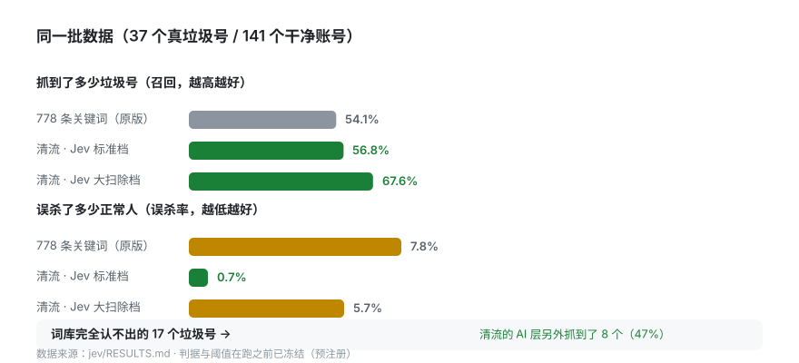
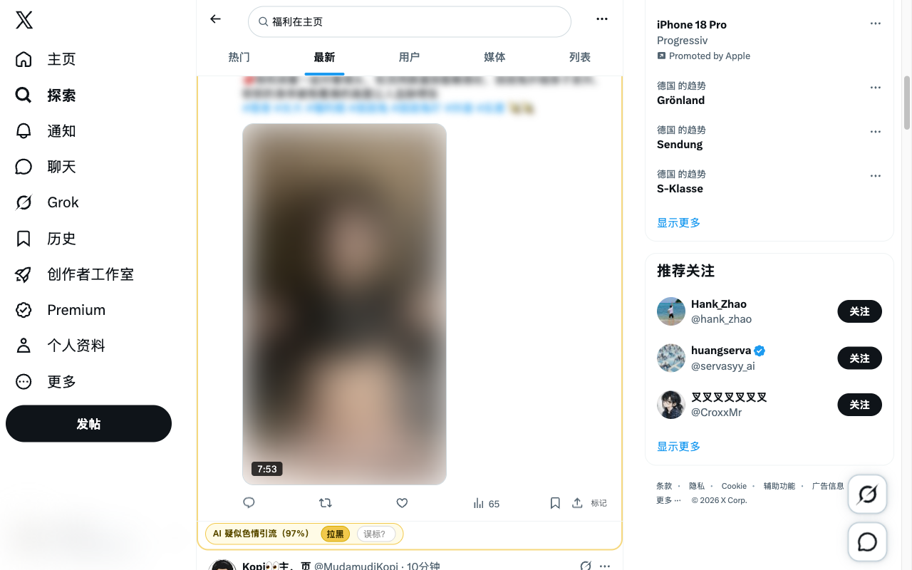

<p align="center">
  
</p>

<h1 align="center">清流 Qingliu</h1>

<p align="center">
  <strong>X 的下水道里，给自己接一根清流管。</strong><br>
  黄框标出垃圾账号 → 一键原生拉黑 → 手机端同步消失。<br>
  外加一个<strong>用实测标定过阈值</strong>的 AI 判定层。
</p>

<p align="center">
  <a href="../../actions/workflows/verify.yml"></a>
  <a href="LICENSE"></a>
  
  
</p>

<p align="center">
  <a href="../../releases/latest"><strong>⬇️ 下载安装包（免 Node 环境）</strong></a>
  ·
  <a href="#30-秒上手">30 秒上手</a>
  ·
  <a href="#实测数据">实测数据</a>
  ·
  <a href="#工作原理">工作原理</a>
  ·
  <a href="#诚实说清楚局限">局限</a>
</p>

---

## 先说清楚这是什么

**上游 [FeedSieve / 福滤娃](https://github.com/realchendahuang/feedsieve) 已于 2026-09 停运**：
仓库转私、官网关闭、社区名单服务器连接失败（实测 `feedsieve-api.chendahuang.com` 已不可达）。

清流是基于它 MIT 源码的延续，做了两件它没做完的事：

1. **补上 roadmap 里从 v0.5 挂到收摊都没落地的 AI 识别层**（原代码里 `DetectionSource`
   早早留了 `'ai'`，却从没产出过一条判定）；
2. **把死掉的服务端接缝做干净** —— 默认零网络请求、零多余权限，自部署或托管随时接回。

> **为什么这件事现在才做得了**：AI 判定层在过去是奢侈品 —— 按 LLM 的价格，
> 给每条时间线内容判一次，成本高到不可能。而 TypeSafe 的 **Jev** 是结构化决策模型
> （不生成文本、只回概率），**单账号判定实测 $0.000032**。经济学前提变了，产品才成立。

---

## 实测数据

**光说"更准"没有意义。** 下面每个数字都来自本仓库的离线评测：**37 个真垃圾号 vs 141 个干净账号**，
判据在跑任何一次测量之前就已冻结（[预注册](jev/PREREGISTRATION.md)），
数据两侧的标签都做了**双向审计**（[结果](jev/RESULTS.md)）。

<p align="center">
  
</p>

<p align="center">
  
  <br>
  <sub>真实截图（内容与账号名已模糊处理）：关键词层没认出，AI 层判「色情引流 97%」并给出黄框</sub>
</p>

| | 778 条关键词（原版） | 清流 · Jev 标准档 |
|---|---:|---:|
| 抓到垃圾号（召回） | 54.1% | **56.8%** |
| **误杀正常人** | **7.8%** | **0.7%** |
| 词库完全认不出的垃圾号 | 0% | **47%** |
| 单账号成本 | $0 | $0.000032 |
| 判定延迟 | 0ms（本地匹配） | p50 0.47s（10 个账号一批） |

**一句话**：清流用 **1/11 的误杀率**，拿到了和 778 条词库相同的召回；
而词库**永远认不出**的那批（换话术、软广、英文机器人），它还能再抓一半。

其它实测结论（都在 [jev/RESULTS.md](jev/RESULTS.md)）：

- **扇出几乎免费**：10 个账号塞进一次调用，判定一致率 **96.2%**，没有"串味"；
- **不是背名单**：把 handle 换成随机串后 AUC 只降 **0.011** —— 模型在读内容，不是在认账号；
- **公开名单会腐坏**：881 条现成黄推名单里 **84% 的账号已经注销** ——
  这正说明为什么"名单"不够，需要能**当场判**的一层。

**真机验证过，不是只跑了单测**：用 Playwright 驱动真实 Chromium 加载扩展、以真实 x.com 会话跑通
「内容脚本 → 后台 → Jev API → 阈值 → 黄框」全链路。第一次跑就抓到一个**关键词层完全没命中**的
成人引流号（网盘链接导流）—— 这是上面那张表里「词库认不出的还能抓 47%」在生产形态下的当场复现。
方法见 [`jev/RESULTS.md`](jev/RESULTS.md) 第五节。

---

## 30 秒上手

1. 到 [Releases](../../releases/latest) 下载 `qingliu-*-chrome.zip` 并解压（Chrome 应用商店版本在审核中）
2. 打开 `chrome://extensions` → 右上角开启**开发者模式** → **加载已解压的扩展程序** → 选解压出的目录
3. 打开 [x.com](https://x.com) 正常刷。垃圾账号会被**黄框**标出，点「拉黑」即走 X 原生拉黑

**两个可选设置（都在扩展弹窗 → 设置里）**：

| 设置 | 作用 |
|---|---|
| **识别强度** | 清爽 / 标准 / 大扫除 —— 三档对应不同误杀预算，标准档实测误杀 0.7% |
| **AI 判定（Jev）** | 默认关闭。填自己的 Typesafe key 后开启，用于抓词库认不出的号 |

> **AI 判定为什么默认关闭**：它需要把账号资料发到 TypeSafe 服务器。
> 这种代价必须由你**显式同意**，不能靠默认值偷偷发生。不开也完全能用（词库 + 内置名单）。

---

## 工作原理

```text
x.com 时间线
   │
   ├─ 1. 社区/内置名单 ──── 命中 → 黄框（可进「一键拉黑」）
   │
   ├─ 2. 话术指纹（SimHash）── 命中 → 大扫除档黄框
   │
   ├─ 3. 关键词库（778 条）── 命中 → 黄框（只提示，不自动拉黑）
   │
   └─ 4. AI 判定（Jev）── 前三层全没认出时才问一次
             │
             └→ 只出黄框 · 永不自动拉黑
   │
   ▼
待拉黑列表（持久、可增删）→ 你按下「一键拉黑」→ 走 X 原生菜单逐个执行
```

**AI 层的位置很关键**：它排在**最后一层**。前面任何一层命中都不会问 AI，
所以它永远不会覆盖名单、也永远不会覆盖你自己写的关键词。

**产品红线（继承自上游，我们没有改）**：

- **标注永不隐藏内容** —— 只加黄框，不动 DOM 可见性；
- **所有拉黑由你显式触发** —— 没有"全自动清理"，AI 判定甚至不进批量候选；
- **误标一键放回** —— 而且你的「误标？」会作为纠错证据帮助我们调阈值。

---

## 隐私：默认什么都不发

| 数据 | 去向 |
|---|---|
| 名单 / 词库 / 指纹匹配 | **全在本机**，零网络请求 |
| 你的关注列表（保护名单） | **只存本机**，永不上传 |
| X 登录态 | 只在**你点击拉黑时**用于请求 x.com 本身，我们不碰 |
| **AI 判定（默认关闭）** | 开启后：handle / 昵称 / 简介 / 计数 / 当前可见推文 / 外链域名 → `api.typesafe.ai` |
| AI 判定结果 | 本机缓存 7 天（按内容指纹失效），同一账号不重复发送 |
| 你的 API key | 只存本机 `browser.storage.local` |

完整中英文政策见 [PRIVACY.md](PRIVACY.md)。**社区名单服务默认不启用**，
所以默认状态下扩展不申请任何第三方服务端权限。

---

## 诚实说清楚局限

一个不写局限的项目不值得信。以下是**我们知道的**问题：

1. **不能保证一直能用**。整个产品建立在 X 的页面结构上，X 改版就会坏。
   这是所有这类工具的宿命，上游也正是因此难以长期维护。我们会尽快修，但它一定会发生。
2. **样本量不大**。阴性只有 141 个账号，观察到 1 个误杀时真实误杀率的 95% 上界约 3.7%；
   阳性只有 37 个，召回的置信区间很宽（约 ±15%）。**请不要把 0.7% 当成精确值。**
3. **AI 层不是万能的**。在误杀为零的阈值上，它只抓到约 46–57% 的垃圾号 ——
   另一半仍然会漏过。它是"少误杀"的工具，不是"全清干净"的工具。
4. **不自动拉黑**。这是刻意的：误杀一个真人比漏掉一个垃圾号贵得多。
   想更激进可以把强度调到「大扫除」，但仍然要你自己按下按钮。
5. **社区名单默认关闭**（上游服务器已停运）。你在本机的拉黑记录仍然是完整的，
   只是暂时不会汇成公共名单。
6. **需要自带 Jev key 才能开 AI 层**。托管档（免 key）在计划中。

---

## 开发者

```bash
pnpm install
pnpm verify        # lint + 词库校验 + typecheck + 全部测试 + 构建扩展
pnpm build:extension
```

| 目录 | 内容 |
|---|---|
| `packages/detector` | 检测纯逻辑（名单 / 指纹 / 启发式） |
| `packages/jev-detect` | **AI 判定层**：状态拼装 / 扇出提问 / 缓存 / 政策 |
| `packages/x-adapter` | X 页面读取与原生动作 |
| `packages/block-queue` | 持久化拉黑队列 |
| `packages/community-lists` | 社区名单消费协议 |
| `apps/extension` | WXT + React 扩展本体（Manifest V3） |
| `apps/community-api` | Cloudflare Workers 社区后端（**可选**，默认不用） |
| `jev/` | 离线评测：预注册判据、采集、判定、标签审计、结论 |

**评测可复现**（数据集因含真实账号资料不随仓库分发，方法完全公开）：

```bash
python3 jev/build_dataset.py --pos 80 --neg 80        # 采集
python3 jev/judge.py --mode normal --batch 10 --max-tweets 1 --tag online
JEV_STATE_TAG=online python3 jev/label_audit.py       # 审计 + 阈值扫描
```

> ⚠️ **构建路径不能含半角括号**：WXT 0.21.4 会把入口路径直接塞进 `new RegExp()`
> 而不转义（`removeEntrypointMainFunction.mjs`），路径里有 `)` 就会
> `Invalid regular expression: Unmatched ')'`。克隆到无括号路径再构建即可。
> （Release 里的 zip 就是为绕开这一步准备的。）

---

## 归属与许可

- 本项目是 **FeedSieve / 福滤娃**（作者 陈大黄 [@realchendahuang](https://x.com/realchendahuang)）
  的衍生作品，基于其 MIT 源码。原始版权声明完整保留在 [LICENSE](LICENSE)，详见 [NOTICE](NOTICE)。
- "FeedSieve"、"福滤娃" 是上游项目的名字，此处仅用于说明来源，**不是本项目的品牌**。
- "Jev" 是 TypeSafe AI 的产品；本项目只是调用其公开 API，命名上仅作描述性使用。
- 本项目同样以 **MIT** 发布：客户端开源，服务端（名单/托管判定）可自行部署或使用托管档。

---

<details>
<summary><b>English</b></summary>

**Qingliu** is an X (Twitter) timeline cleaner forked from **FeedSieve** (MIT) after upstream
shut down in 2026-09. It adds the AI verdict layer upstream planned but never shipped, powered by
[TypeSafe Jev](https://www.typesafe.ai/) — a decision model that returns calibrated probabilities
instead of text, at **$0.000032 per account**.

**Measured on 37 confirmed spam accounts vs 141 clean ones** (criteria pre-registered before any
measurement, labels audited on both sides — see [jev/RESULTS.md](jev/RESULTS.md)):

| | 778 keyword rules (original) | Qingliu · Jev |
|---|---:|---:|
| Spam caught (recall) | 54.1% | **56.8%** |
| **Real users wrongly flagged** | **7.8%** | **0.7%** |
| Spam the keywords never match | 0% | **47%** |

**Install**: download the zip from [Releases](../../releases/latest), unzip, then
`chrome://extensions` → Developer mode → Load unpacked.

**Privacy**: everything runs locally by default. The AI layer is **off by default** and only
sends account profile text to TypeSafe after you explicitly enable it with your own API key.

**Red lines inherited from upstream**: marks never hide content, every block is user-triggered,
and the AI layer never auto-blocks.

</details>
